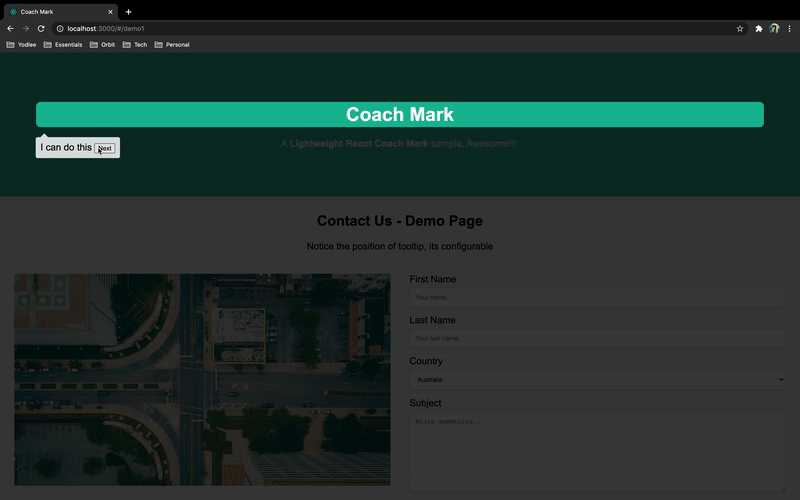
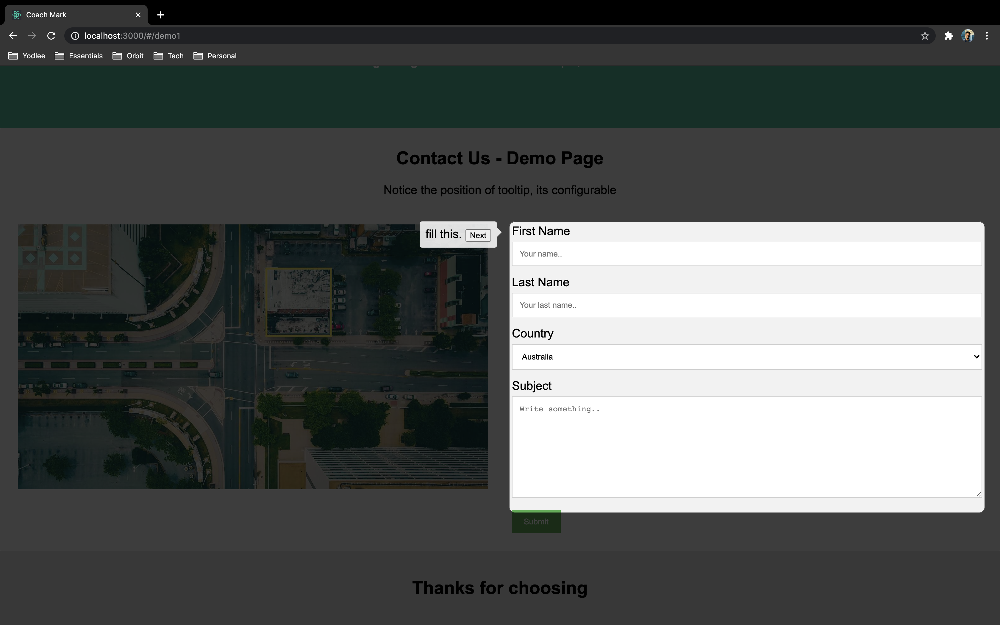

## React Coach Mark

A light weight coach mark library on react.

### Applications

* Intro screen
* Splash screen
* Live tutorials
* Guided experience

### Demo



### Usage

``` jsx
const coach: ICoachProps = {
        activate: true,
        component: <div>Any Component You Want</div>,
        reference: ref,
        tooltip: { position: 'bottom' }
    };
<CoachMark {...coach} />
```

### Project Structure

`src` folder contains demo as well as library code. Go to the `lib folder` from [here](./src/lib) to check the source code.

### Installation

To clone
`` `git clone https://github.com/hashlucifer/react-coach-mark.git` ``
To install
`` `npm install` ``
To start
`` `npm start` ``

I will soon publish git/npm repository for further use

### Integration code 

There are just 4 params you need to feed in as basic props.

* `activate` : *boolean* to enable/disable the black screen
* `component` : *Element* can be any valid React Node.
* `reference` : will be react *ref*
* `tooltip` : having position of tooltip w.r.t focused element on screen.

Check out `demo file` [here](./src/pages/demo-one.tsx) for integrations steps.

### You control the flow and view

Step 1: Create and Assign ref (hooks version), it also works for class version.

``` jsx
const ref1 = useRef(null);
const ref2 = useRef(null);
// assign it to div
<h1 ref={ref1}>Coach Mark</h1>
<p ref={ref2}>Any ref based element</p>
```

Step 2: Create state and write your next/prev/skip handlers

``` jsx
const [activatedNumber, setActivateNumber] = useState<number>(0);
const NextButton = <button onClick={() => setActivateNumber(activatedNumber + 1)}>Next</button>;
```

Step 3: You control the flow, you control the components it will render.

``` jsx
 const coachList: Array<ICoachProps> = [
    {
        activate: activatedNumber === 0,
        component: <div>I can do this {NextButton} </div>,
        reference: ref1,
        tooltip: { position: 'bottom' }
    },
    {
        activate: activatedNumber === 1,
        component: <div>I can be long. {NextButton}</div>,
        reference: ref2,
        tooltip: { position: 'top' }
    }
 ]

const coach : ICoachProps = coachList[activatedNumber]
```

Step 4: Just pass the configuration to the coach mark

``` jsx
<CoachMark {...coach} />
```

### Sample Screenshot



> Please note that : This works individually as well by calling it twice

`<CoachMark {...coach1} />` and `<CoachMark {...coach2} />` but it might not give smooth css transition for one focus to another.

Please feel free to connect and  contribute. Happy Coding.
